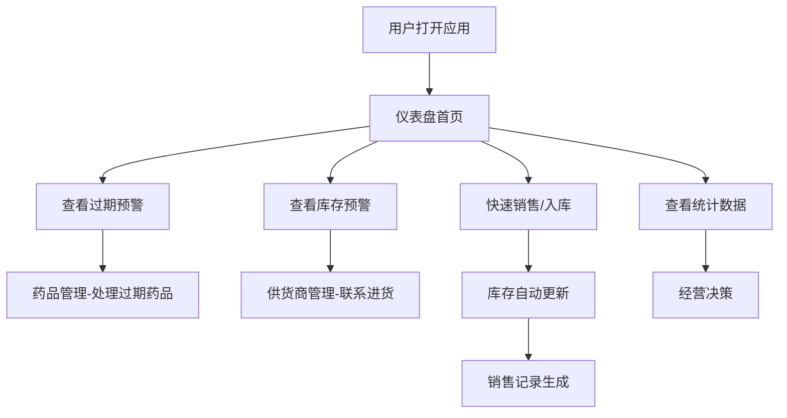

## 1. 产品概述

本产品是面向小型药店的药品有效期和库存预警管理工具，帮助药店经营者高效管理药品库存、监控有效期、记录销售数据、分析经营情况，降低药品过期损耗，提升经营效率。

- 主要用途：药品有效期预警、库存管理、销售记录、经营分析、供货商管理
- 目标用户：小型药店店主、店员
- 产品价值：减少药品过期损失，优化库存管理，提升经营决策效率

## 2. 核心功能

### 2.1 用户角色

| 角色 | 登录方式 | 核心权限 |
|------|----------|----------|
| 药店管理员 | 无需登录（本地应用） | 全部功能，包括药品管理、库存操作、销售记录、数据统计、供货商管理 |

### 2.2 功能模块

1. **仪表盘首页**：过期预警概览、库存预警概览、今日销售概览、快捷操作入口
2. **药品管理**：药品列表、新增/编辑/删除药品、有效期管理、分类管理
3. **库存管理**：库存查看、入库操作、出库（销售）操作、安全库存设置
4. **销售统计**：销量排行榜、利润排行榜、销售趋势
5. **促销活动**：活动列表、创建活动（如买二送一）、活动效果统计
6. **供货商管理**：供货商列表、新增/编辑/删除供货商、联系信息管理

### 2.3 页面详情

| 页面名称 | 模块名称 | 功能描述 |
|----------|----------|----------|
| 仪表盘 | 过期预警卡片 | 显示即将过期药品数量，按紧急程度分级（30天内、7天内、已过期） |
| 仪表盘 | 库存预警卡片 | 显示低于安全库存的药品数量和列表 |
| 仪表盘 | 今日销售概览 | 显示今日销售额、销售数量、利润 |
| 仪表盘 | 快捷操作 | 快速入库、快速销售、新增药品入口 |
| 药品管理 | 药品列表 | 展示所有药品，支持搜索、分类筛选 |
| 药品管理 | 药品表单 | 新增/编辑药品信息（名称、分类、规格、进价、售价、生产日期、有效期、安全库存） |
| 库存管理 | 库存列表 | 展示所有药品库存，支持按库存数量排序 |
| 库存管理 | 入库操作 | 增加库存数量，记录入库时间和批次 |
| 库存管理 | 销售出库 | 减少库存数量，记录销售信息 |
| 销售统计 | 销量排行 | 按销量排序的药品排行榜 |
| 销售统计 | 利润排行 | 按利润排序的药品排行榜 |
| 促销活动 | 活动列表 | 展示进行中和已结束的促销活动 |
| 促销活动 | 活动创建 | 创建促销活动（买赠、折扣等），设置活动时间和规则 |
| 促销活动 | 活动效果 | 统计活动期间销量增长、额外销售数量 |
| 供货商管理 | 供货商列表 | 展示所有供货商信息 |
| 供货商管理 | 供货商表单 | 新增/编辑供货商（名称、联系人、电话、地址、主营品类） |

## 3. 核心流程

### 3.1 药品入库流程
用户进入库存管理页面，选择药品，填写入库数量和进价，确认后库存增加，同时更新药品最新进价。

### 3.2 销售出库流程
用户在首页或库存页面点击销售，选择药品，填写销售数量和售价（可选），系统自动计算金额和利润，库存减少，记录销售流水。

### 3.3 过期预警流程
系统每日自动计算所有药品距离过期的天数，在仪表盘按紧急程度分级展示，用户可点击查看详情并采取处理措施。

### 3.4 促销活动流程
用户创建促销活动（如买二送一），设置活动时间和参与药品。活动期间销售时系统自动应用优惠规则，活动结束后统计活动效果（多卖了多少）。

## 4. 用户界面设计

### 4.1 设计风格
- **主色调**：医药绿色系（#10B981 翠绿），代表健康、专业
- **辅助色**：红色（#EF4444）用于高危预警，橙色（#F59E0B）用于中等预警，绿色用于正常状态
- **背景色**：浅灰蓝色背景，干净清爽
- **卡片风格**：圆角卡片，柔和阴影，层次分明
- **字体**：现代无衬线字体，清晰易读
- **图标风格**：线性图标，简洁明了

### 4.2 页面设计概览

| 页面名称 | 模块名称 | UI 元素 |
|----------|----------|---------|
| 仪表盘 | 预警卡片 | 渐变背景色、大数字展示、状态标签、动画效果 |
| 仪表盘 | 数据概览 | 四宫格卡片、图标+数字、趋势箭头 |
| 仪表盘 | 快捷操作 | 大按钮、图标+文字、悬停效果 |
| 药品管理 | 列表页 | 表格布局、搜索框、分类筛选、状态标签 |
| 药品管理 | 表单弹窗 | 分栏布局、必填标记、实时校验 |
| 销售统计 | 排行榜 | 排名徽章、进度条、金额格式化 |
| 供货商管理 | 卡片列表 | 头像+信息、联系按钮、地址展示 |

### 4.3 响应式
- 桌面端优先设计，适配平板和手机
- 侧边栏导航在移动端转为底部Tab导航
- 表格在移动端转为卡片列表展示
- 触摸友好，按钮最小尺寸44px

### 4.4 交互细节
- 预警数字呼吸动画，提醒用户注意
- 数据加载时骨架屏效果
- 操作成功/失败的Toast提示
- 列表项悬停微交互
- 页面切换平滑过渡
