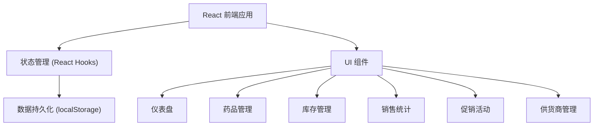
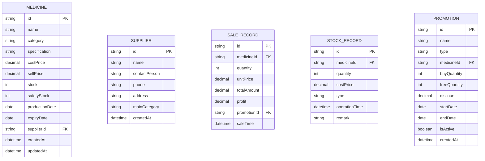

## 1. 架构设计

本项目为纯前端单页应用，数据存储在浏览器本地（localStorage），无需后端服务。

## 2. 技术描述

- **前端框架**：React@18 + TypeScript
- **构建工具**：Vite@5
- **样式方案**：Tailwind CSS@3
- **路由**：React Router DOM@6
- **图标库**：Lucide React
- **数据存储**：localStorage（本地持久化）
- **图表**：Recharts（用于销售趋势图）
- **状态管理**：React Context + useReducer

## 3. 路由定义

| 路由 | 页面名称 | 功能描述 |
|------|----------|----------|
| / | 仪表盘 | 过期预警、库存预警、销售概览、快捷操作 |
| /medicines | 药品管理 | 药品列表、新增/编辑/删除药品 |
| /inventory | 库存管理 | 库存列表、入库、出库操作 |
| /sales | 销售统计 | 销量排行、利润排行、销售趋势 |
| /promotions | 促销活动 | 活动列表、创建活动、活动效果 |
| /suppliers | 供货商管理 | 供货商列表、新增/编辑/删除 |

## 4. 数据模型

### 4.1 数据模型定义

### 4.2 数据结构说明

**药品 (Medicine)**
- `id`: 唯一标识
- `name`: 药品名称
- `category`: 分类（感冒药、降压药、消炎药、维生素等）
- `specification`: 规格（如"0.5g*24片"）
- `costPrice`: 进价
- `sellPrice`: 售价
- `stock`: 当前库存数量
- `safetyStock`: 安全库存（低于此值预警）
- `productionDate`: 生产日期
- `expiryDate`: 有效期至
- `supplierId`: 供货商ID
- `createdAt/updatedAt`: 创建/更新时间

**供货商 (Supplier)**
- `id`: 唯一标识
- `name`: 供货商名称
- `contactPerson`: 联系人
- `phone`: 联系电话
- `address`: 地址
- `mainCategory`: 主营品类

**销售记录 (SaleRecord)**
- `id`: 唯一标识
- `medicineId`: 药品ID
- `quantity`: 销售数量
- `unitPrice`: 单价
- `totalAmount`: 总金额
- `profit`: 利润
- `promotionId`: 关联促销活动ID（可选）
- `saleTime`: 销售时间

**库存记录 (StockRecord)**
- `id`: 唯一标识
- `medicineId`: 药品ID
- `quantity`: 变动数量（正为入库，负为出库）
- `costPrice`: 进价
- `type`: 类型（in/out）
- `operationTime`: 操作时间
- `remark`: 备注

**促销活动 (Promotion)**
- `id`: 唯一标识
- `name`: 活动名称
- `type`: 活动类型（buy_get_free/discount）
- `medicineId`: 关联药品ID
- `buyQuantity`: 买几（买赠活动）
- `freeQuantity`: 送几（买赠活动）
- `discount`: 折扣率（折扣活动，如0.8表示8折）
- `startDate`: 开始日期
- `endDate`: 结束日期
- `isActive`: 是否启用

## 5. 核心模块设计

### 5.1 过期预警计算
- 计算当前日期与有效期的差值
- 分级：已过期（<0天）、紧急（≤7天）、预警（≤30天）、正常（>30天）
- 每日自动重新计算

### 5.2 库存预警
- 库存 ≤ 安全库存时触发预警
- 预警级别：严重（库存=0）、警告（库存<安全库存的50%）、提醒（库存≤安全库存）

### 5.3 促销活动计算
- 买赠活动：按 buyQuantity + freeQuantity 为一组计算赠送数量
- 折扣活动：售价 × discount
- 活动效果统计：对比活动期前后相同天数的销量差异

### 5.4 销售统计
- 按时间段筛选销售记录
- 按药品分组统计销量、销售额、利润
- 排行榜支持按销量/利润/销售额排序
